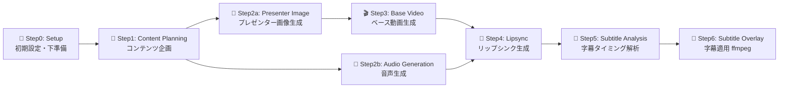

# Presenter Video Generation Workflow - 実行手順

Claude Code（私）がプレゼンター動画生成ワークフローを実行する際の詳細手順書です。

## 前提条件

- 入力パラメータが適切に設定されていること
- MCP設定ファイル `.claude/mcp-kamuicode.json` が存在すること
- **ffmpegがインストール済みであること** (動画・音声処理に必須)
- **curlコマンドが利用可能であること** (ファイルダウンロードに必須)

## ワークフロー実行順序



---

## 入力パラメータ

### 必須パラメータ

- `topic`: **プレゼンテーションのトピック・テーマ**
  - 作成するコンテンツのテーマやトピックを簡潔に表現
- `content`: **コンテンツの具体的内容・情報**
  - 説明したい具体的な情報や事実を記述
  - この内容がコンテンツ企画のベースとなる

#### 入力例
  - topic: `"新しいスマートウォッチの紹介"`
  - content: `"最新技術を搭載したスマートウォッチの機能と利便性について説明します。健康管理、通知機能、バッテリー寿命など、日常生活を向上させる特徴を詳しく紹介します。"` 
  - video-duration: 30

### 任意パラメータ（デフォルト値あり）

- `target-language`: 翻訳先言語 (japanese/english) ・ デフォルト: `japanese`
- `folder-name`: プロジェクトフォルダ名 ・ デフォルト: `result/presenter/{TIMESTAMP}`
- `video_index`: 動画インデックス ・ デフォルト: `1`
- `video-duration`: 動画の長さ（秒） ・ デフォルト: `60`
- `speaker-type`: 話し手タイプ ・ デフォルト: `news-anchor`
  - 利用可能なタイプ:
    - `news-anchor`: ニュースアナウンサー（正式なニュース報道）
    - `receptionist`: 受付・秘書（来客対応、案内業務）
    - `pr-representative`: 広報担当（企業発表、プレスリリース）
    - `sales-person`: 営業担当（商品販売、プレゼンテーション）
    - `youtuber`: YouTuber・インフルエンサー（商品紹介、エンタメ）
    - `instructor`: 講師・インストラクター（教育、研修）
    - `ceo`: 経営者・役員（企業ビジョン、株主向け）
    - `custom`: カスタムキャラクター（既存の画像を使用）
  - 各タイプに応じた適切な服装、背景、口調が自動設定される
- `speaker-gender`: 話し手の性別 ・ デフォルト: `female`
  - 利用可能な性別: `female`, `male`
- `presentation-style`: プレゼンテーションスタイル ・ デフォルト: `formal`
  - 利用可能なスタイル: `formal`, `casual`, `friendly`, `energetic`
  - `formal`: 丁寧で正式なスタイル
  - `casual`: リラックスした親しみやすいスタイル
  - `friendly`: 温かく歓迎的なスタイル
  - `energetic`: 活気に満ちた情熱的なスタイル
- `aspect-ratio`: 画面比率 ・ デフォルト: `9:16`
  - 利用可能な比率: `1:1`, `9:16`, `16:9`, `3:4`, `4:3`
- `text-prompt`: カスタムプレゼンテーション原稿 ・ デフォルト: 空（自動生成）
  - 音声生成用に使用する完成されたプレゼンテーション原稿
  - 指定した場合、`content`より優先され、自動企画ステップをスキップ
  - 既に完成したプレゼンテーション原稿がある場合に使用
- `character-image`: カスタムキャラクター画像 ・ デフォルト: 空
  - `speaker-type=custom` 時に必須
  - URLまたはローカルファイルパスを指定
  - URLの場合: `http://` または `https://` で始まる完全なURL
  - ローカルファイルの場合: プロジェクトルートからの相対パスまたは絶対パス
- `character-description`: カスタムキャラクターの説明 ・ デフォルト: 空
  - `speaker-type=custom` 時に使用（オプション）
  - キャラクターの外見や特徴を説明するテキスト
  - i2i変換時のプロンプト生成に使用される

#### 入力例 (任意パラメータを追加した例)

**YouTuber男性による商品紹介例**:
- topic: `"新しいスマートウォッチの紹介"`
- content: `"最新技術を搭載したスマートウォッチの機能と利便性について説明します。健康管理機能では心拍数、血圧、睡眠パターンを24時間モニタリングし、AIが個人に最適化された健康アドバイスを提供します。通知機能では重要なメッセージのみを厳選して表示し、集中力を妨げません。バッテリー寿命は最大7日間持続し、急速充電にも対応しています。"`
- speaker-type: `youtuber`
- speaker-gender: `male`
- presentation-style: `energetic`
- video-duration: 30

**受付女性による会社案内例（横長動画）**:
- topic: `"会社紹介"`
- content: `"弊社は1995年創立以来、IT技術を通じて社会課題の解決に取り組んでまいりました。従業員数300名、国内外に5つのオフィスを構え、AI・IoT・クラウドサービスを中心とした事業を展開しております。お客様第一主義をモットーに、革新的なソリューションの提供を通じて、より良い未来の実現に貢献しています。"`
- speaker-type: `receptionist`
- speaker-gender: `female`
- presentation-style: `friendly`
- aspect-ratio: `16:9`
- video-duration: 30

**カスタムキャラクターを使用した商品紹介例**:
- topic: `"新製品スマートフォンの紹介"`
- content: `"最新のAIチップを搭載したスマートフォンは、写真撮影、バッテリー寿命、処理速度において革新的な進化を遂げました。プロカメラマンも驚く高画質撮影、2日間持続するバッテリー、そして5G対応による超高速通信を実現しています。"`
- speaker-type: `custom`
- character-image: `https://lh3.googleusercontent.com/YrRrPZzc5JH1DNYdfLWNzHwEjGfFD3tr0jauSOQnJwzAN-W5l3kqJCVyzZrE5k2u6PqlnUyc1By7hOc5QW_WcfQM4xs_ZQ19AD43k1AFy2-GUJwUBB4=w500`
- character-description: `3Dキャラクター ドロイド君`
- presentation-style: `energetic`
- video-duration: 30

**ローカル画像を使用したカスタムキャラクター例**:
- topic: `"オンライン学習プラットフォームの紹介"`
- content: `"私たちの革新的なオンライン学習プラットフォームは、AIによる個別指導、リアルタイムフィードバック、ゲーミフィケーション要素を組み合わせ、学習効果を最大化します。"`
- speaker-type: `custom`
- character-image: `./assets/characters/presenter.png`
- character-description: `プロフェッショナルな服装の女性キャラクター`
- presentation-style: `formal`
- aspect-ratio: `16:9`
- video-duration: 30

## ステップ0: 初期設定・下準備

### 一括実行スクリプト

**重要**: 以下のスクリプトを1つのBashセッションで実行してください（環境変数の引き継ぎのため）

**スクリプトファイル**: [step0-setup.sh](./bash/step0-setup.sh)

```bash
# 使用例（デフォルト: ニュースアナウンサー女性、画面比率9:16）
TOPIC="日本のAI技術革新" CONTENT="日本政府が発表したAI新戦略によると..." ./docs/workflow/bash/step0-setup.sh

# YouTuber男性による商品紹介動画（エネルギッシュスタイル）
TOPIC="新しいスマートウォッチの紹介" CONTENT="最新技術を搭載したスマートウォッチの機能と..." SPEAKER_TYPE="youtuber" SPEAKER_GENDER="male" PRESENTATION_STYLE="energetic" ./docs/workflow/bash/step0-setup.sh

# 受付女性による会社案内動画（フレンドリースタイル、横長）
TOPIC="会社紹介" CONTENT="弊社は1995年創立以来、IT技術を通じて社会課題の解決に..." SPEAKER_TYPE="receptionist" SPEAKER_GENDER="female" PRESENTATION_STYLE="friendly" ASPECT_RATIO="16:9" ./docs/workflow/bash/step0-setup.sh
```

---

## ステップ1: コンテンツ企画 (content-planning-prompt.md ベース)

### 実行手順

**重要**: このステップはClaude Code（AI）が実行します。bashコマンドではありません。

1. **入力パラメータの確認**
   - Step0で作成された `workflow-info.json` から以下の値を取得:
     - `topic`: プレゼンテーショントピック
     - `content`: ユーザー指定のコンテンツ内容  
     - `target_language`: 翻訳先言語
     - `presentation_style`: プレゼンテーションスタイル
     - `video_duration`: 動画の長さ
     - `speaker_type`: 話し手タイプ
     - `speaker_gender`: 話し手の性別
     - `speaker_personality`: 話し手の性格
     - `text_prompt`: カスタムテキストプロンプト
     - `folder_name`: 作業フォルダ名

2. **プロンプトファイル読み込み**
   - Readツールで [content-planning-prompt.md](./prompts/presenter-video-generation/content-planning-prompt.md) を読み込み
   - プロンプト内の変数を実際の値に置換

3. **プランニングファイル作成**
   
   以下のファイルを `{FOLDER_NAME}/video{VIDEO_INDEX}/planning/` ディレクトリに作成:

   | ファイル名 | 内容 | 言語 |
   |------------|------|------|
   | `audio-prompt.txt` | プレゼンテーション原稿（音声生成用） | 日本語 |
   | `image-prompt.txt` | プレゼンター画像生成用プロンプト | 英語 |
   | `video-concept.txt` | プレゼンター動画生成用コンセプト | 英語 |
   | `voice-settings.json` | 音声設定（JSON形式） | - |
   | `content-title.txt` | コンテンツタイトル | 英語 |
   | `content-summary.txt` | コンテンツ要約 | 日本語 |
   | `content-plan.md` | 企画書（Markdown形式） | 日本語 |

4. **作成完了確認**
   - [x] 全7ファイルが正常に作成されたことを確認
   - [x] 各ファイルの内容がプロンプトの要件を満たしていることを確認

---

## ステップ2a: プレゼンター画像生成 (module-image-generation-kc-multi-model-ccsdk.yml / i2i-fal-flux-kontext-max ベース)

### 入力パラメータ
- `topic`: ユーザーのトピック（Step0の出力）
- `image-prompt`: 画像生成用プロンプト（ステップ1の出力）
- `model-type`: 使用する画像生成モデル
  - `speaker-type=custom`以外: t2i-fal-imagen4-ultra（デフォルト）
  - `speaker-type=custom`: i2i-fal-flux-kontext-max
- `folder-name`: プロジェクトフォルダ名（Step0の出力）
- `video_index`: 動画インデックス（Step0の出力）
- `aspect-ratio`: 画面比率（Step0の出力）
- `character-image`: カスタムキャラクター画像（Step0の出力、speaker-type=custom時）
- `character-image-type`: 画像タイプ（url/local）（Step0の出力、speaker-type=custom時）

### 実行ステップ

1. **画像生成エージェント実行**
   ```
   TOPIC="{topic}"
   PLANNED_IMAGE_PROMPT="{image-prompt}"
   MODEL_TYPE="{model-type}"
   FOLDER_NAME="{folder-name}"
   VIDEO_INDEX="{video_index}"
   ASPECT_RATIO="{aspect-ratio}"
   
   # 新しいパス構造
   VIDEO_BASE_DIR="$FOLDER_NAME/video$VIDEO_INDEX"
   IMAGES_DIR="$VIDEO_BASE_DIR/images"
   
   # 画像ディレクトリ（Step0で作成済み）
   echo "Using images directory: $IMAGES_DIR"
   ```

2. **画像生成実行**
   
   🚨 **重要**: 必ずReadツールで以下のプロンプトファイルを読み込んでから実行してください。記憶や想像でプロンプトを作成しないでください。
   
   **プロンプトファイル**: [image-generation-prompt.md](./prompts/presenter-video-generation/image-generation-prompt.md)
   
   **speaker-type による処理分岐**:
   
   a) **通常のspeaker-type（news-anchor, youtuber等）の場合**:
      - t2i-fal-imagen4-fast を使用
      - MCPツール使用:
        - submitツールで画像生成開始
        - statusツールでステータス確認
        - resultツールで結果取得してGoogle URLを取得
        - curlで画像を保存
   
   b) **speaker-type=custom の場合**:
      - character-image-type=local の場合:
        - step2a-character-upload.sh スクリプトを実行してFALにアップロード
        - スクリプトは自動的にPython仮想環境（プロジェクトルート/.venv）を作成し、fal-clientをインストール
        - fal_client.upload_file()を使用してアップロード実行
        - アップロードされたFAL URLを{IMAGES_DIR}/character-fal-url.txtに保存
        - 保存されたURLを使用
      - character-image-type=url の場合:
        - 指定されたURLをそのまま使用
      - i2i-fal-flux-kontext-max を使用
      - MCPツール使用:
        - image_url にキャラクター画像URLを指定
        - prompt にはi2iプロンプト（ステップ1で生成）を使用
        - aspect_ratio を指定
        - submitツールで画像変換開始
        - statusツールでステータス確認
        - resultツールで結果取得して変換後の画像URLを取得
        - curlで画像を保存

3. **生成された画像の確認と保存**
   ```bash
   if [ -d "$IMAGES_DIR" ]; then
     # Google URLファイルの確認
     if [ -f "$IMAGES_DIR/image-url.txt" ]; then
       GOOGLE_URL=$(cat "$IMAGES_DIR/image-url.txt")
       echo "Generated image URL: $GOOGLE_URL"
       
       # Google URLから画像をダウンロード保存
       echo "Downloading image from Google URL..."
       wget "$GOOGLE_URL" -O "$IMAGES_DIR/image.png"
       
       if [ -f "$IMAGES_DIR/image.png" ]; then
         echo "✅ Image successfully downloaded and saved"
       else
         echo "❌ Failed to download image from Google URL"
         exit 1
       fi
     else
       echo "❌ Google image URL file not found"
       exit 1
     fi
     
     # 保存された画像の確認
     IMAGE_COUNT=$(find "$IMAGES_DIR" -name "*.png" -o -name "*.jpg" -o -name "*.jpeg" | wc -l)
     if [ "$IMAGE_COUNT" -gt 0 ]; then
       echo "✅ Successfully generated and saved $IMAGE_COUNT images"
     else
       echo "❌ No images were saved"
       exit 1
     fi
   else
     echo "❌ Images directory not found"
     exit 1
   fi
   ```

---

## ステップ2b: 音声生成 (module-audio-generation-kc-multi-model-ccsdk.yml ベース)

### 入力パラメータ
- `topic`: ユーザーのトピック（Step0の出力）
- `model-type`: 使用する音声生成モデル (デフォルト値: t2s-fal-minimax-speech-02-turbo)
- `text-prompt`: 音声生成用テキストプロンプト（ステップ1の出力）
- `voice-settings`: 音声設定（JSON形式）（ステップ1の出力）
- `folder-name`: プロジェクトフォルダ名（Step0の出力）
- `audio_index`: 音声インデックス（Step0の出力）

### 実行手順

**重要**: このステップはClaude Code（AI）が実行します。bashコマンドではありません。

1. **入力パラメータの確認**
   - Step0で作成された `workflow-info.json` と Step1で作成されたプランニングファイルから値を取得:
     - `topic`: ユーザーのトピック
     - `text-prompt`: `audio-prompt.txt` の内容
     - `voice-settings`: `voice-settings.json` の内容
     - `folder-name`: 作業フォルダ名
     - `audio_index`: 音声インデックス（通常1）

2. **プロンプトファイル読み込み**
   - Readツールで `docs/workflow/prompts/presenter-video-generation/audio-generation-prompt.md` を読み込み
   - プロンプト内の変数を実際の値に置換

3. **音声生成実行（制限対応込み）**
   - `module-workflow/kamuicode/kamuicode-usage.md` から対応するMCPツール名を確認
   - submitツールで音声生成開始
   - statusツールでステータス確認
   - resultツールで結果取得して音声URLを取得
   - Google URLを `{AUDIO_DIR}/audio-url.txt` に保存
   - Google URLから `{AUDIO_DIR}/audio.mp3` にダウンロード保存
   - **制限チェック実行**: 生成された音声が制限を超える場合は自動短縮・再生成

4. **音声ファイル検証とリップシンク制限対応**
   
   **スクリプトファイル**: [step2b-audio-validation.sh](./bash/step2b-audio-validation.sh)
   
   ```bash
   # 音声生成後に実行（FOLDER_NAMEはワークフロー情報から取得）
   ./docs/workflow/bash/step2b-audio-validation.sh "$FOLDER_NAME" "$VIDEO_INDEX" "$NEWS_DURATION"

   ## 実行例
   ./docs/workflow/bash/step2b-audio-validation.sh "result/news/20250730-120000" 1 30
   ```

5. **生成完了確認**
   - 音声ファイルが正常に作成されたことを確認
   - `VIDEO_DURATION`が30秒以下の場合のみ、Pixverse制限（30秒/5MB以内）を満たしていることを確認

---

## ステップ3: ベース動画生成 (module-video-generation-kc-multi-model-ccsdk.yml ベース)

### 入力パラメータ
- `topic`: ユーザーのトピック（Step0の出力）
- `model-type`: 使用する動画生成モデル (デフォルト値: i2v-fal-hailuo-02-pro)
- `video-prompt`: 動画生成用プロンプト（Step1の出力：video-concept.txt）
- `image-url`: 画像URL（Step2aの出力）
- `folder-name`: プロジェクトフォルダ名（Step0の出力）
- `video_index`: 動画インデックス（Step0の出力）

### 実行ステップ

**重要**: このステップはClaude Code（AI）が実行します。bashコマンドではありません。

1. **動画生成実行**
   
   🚨 **重要**: 必ずReadツールで以下のプロンプトファイルを読み込んでから実行してください。記憶や想像でプロンプトを作成しないでください。
   
   **プロンプトファイル**: [video-generation-prompt.md](./prompts/presenter-video-generation/video-generation-prompt.md)
   
   MCPツール使用（動画生成系ツールはワイルドカードで許可）:
   - kamuicode-usage.mdから正しいツール名を取得
   - モデルタイプに応じた適切なパラメータ使用
   - submitツールで動画生成開始
   - statusツールでステータス確認（動画生成は時間がかかるため、適度な間隔で確認）
   - 必要に応じて `sleep 60` を実行してから再度ステータス確認
   - resultツールで結果取得して動画URLを取得

---

## ステップ4: リップシンク生成 (module-lipsync-generation-kc-multi-model-ccsdk.yml ベース)

### 入力パラメータ
- `topic`: ユーザーのトピック（Step0の出力）
- `model-type`: 使用するリップシンクモデル (デフォルト値[30秒以下]: v2v-fal-pixverse-lipsync, デフォルト値[30秒より上]: v2v-fal-creatify-lipsync)
- `video-url`: 入力動画URL（Step3の出力）
- `audio-url`: 入力音声URL（Step2bの出力）
- `lipsync-settings`: リップシンク設定（JSON形式、オプション）
- `folder-name`: プロジェクトフォルダ名（Step0の出力）
- `lipsync_index`: リップシンクインデックス（Step0の出力）

### 実行ステップ

**重要**: このステップはClaude Code（AI）が実行します。bashコマンドではありません。

1. **リップシンク生成実行**
   
   🚨 **重要**: 必ずReadツールで以下のプロンプトファイルを読み込んでから実行してください。記憶や想像でプロンプトを作成しないでください。
   
   **プロンプトファイル**: [lipsync-generation-prompt.md](./prompts/presenter-video-generation/lipsync-generation-prompt.md)
   
   MCPツール使用:
   - kamuicode-usage.mdから正しいツール名を取得
   - submitツールでリップシンク生成開始
   - statusツールでステータス確認（リップシンク生成は時間がかかるため、適度な間隔で確認）
   - 必要に応じて `sleep 60` を実行してから再度ステータス確認
   - resultツールで結果取得してリップシンク動画URLを取得

---

## ステップ5: 字幕解析 (module-lipsync-video-analysis-ccsdk.yml ベース)

### 入力パラメータ
- `topic`: ユーザーのトピック（Step0の出力）
- `audio-url`: 音声ファイルURL（Step2bの出力）
- `text-content`: 音声テキスト内容（Step1の出力：audio-prompt.txt）
- `target-language`: 字幕言語（Step0の出力）
- `folder-name`: プロジェクトフォルダ名（Step0の出力）
- `video_index`: 動画インデックス（Step0の出力）

### 実行ステップ

1. **音声メタデータ取得**
   
   **スクリプトファイル**: [step5-subtitle-analysis-check.sh](./bash/step5-subtitle-analysis-check.sh) （メタデータ取得部分）
   
   ```bash
   # 字幕解析後にチェック実行（FOLDER_NAMEはワークフロー情報から取得）
   ./docs/workflow/bash/step5-subtitle-analysis-check.sh "$FOLDER_NAME" "$VIDEO_INDEX"

   ## 実行例
   ./docs/workflow/bash/step5-subtitle-analysis-check.sh "result/news/20250730-120000" 1
   ```

2. **字幕解析エージェント実行**
   ```bash
   AUDIO_URL="{audio-url}"
   TEXT_CONTENT="{text-content}"
   TARGET_LANGUAGE="{target-language}"
   CONCEPT="{concept}"
   FOLDER_NAME="{folder-name}"
   ANALYSIS_DIR="$FOLDER_NAME/subtitle-analysis-{video_index}"
   VIDEO_INDEX="{video_index}"
   AUDIO_DURATION="$DURATION"
   ```

   🚨 **重要**: 必ずReadツールで以下のプロンプトファイルを読み込んでから実行してください。記憶や想像でプロンプトを作成しないでください。
   
   **プロンプトファイル**: [subtitle-analysis-prompt.md](./prompts/presenter-video-generation/subtitle-analysis-prompt.md)
   
   プロンプトに基づいて以下のファイルを作成してください：
   - `subtitle.srt`: SRT形式字幕ファイル
   - `analysis-report.md`: 詳細分析レポート

3. **解析完了確認**
   
   **スクリプトファイル**: [step5-subtitle-analysis-check.sh](./bash/step5-subtitle-analysis-check.sh) （確認部分）
   
   上記のスクリプト（同じパラメータ）で字幕ファイルの生成確認とセグメント数チェックが実行されます。

---

## ステップ6: 字幕オーバーレイ (module-subtitle-overlay-ffmpeg-ccsdk.yml ベース)

### 入力パラメータ
- `topic`: ユーザーのトピック（Step0の出力）
- `video-url`: 元動画URL（Step4の出力）
- `text-content`: 字幕テキスト内容（Step1の出力：audio-prompt.txt）
- `subtitle-srt-content`: SRT字幕ファイル内容（Step5の出力）
- `target-language`: 字幕言語（Step0の出力）
- `folder-name`: プロジェクトフォルダ名（Step0の出力）
- `video_index`: 動画インデックス（Step0の出力）

### 実行ステップ

1. **字幕オーバーレイエージェント実行**
   ```
   USER_CONCEPT="{concept}"
   VIDEO_URL="{video-url}"
   TEXT_CONTENT="{text-content}"
   SUBTITLE_SRT_CONTENT='{subtitle-srt-content}'
   TARGET_LANGUAGE="{target-language}"
   FOLDER_NAME="{folder-name}"
   VIDEO_INDEX="{video_index}"
   
   # 新しいパス構造
   VIDEO_BASE_DIR="$FOLDER_NAME/video$VIDEO_INDEX"
   SUBTITLE_DIR="$VIDEO_BASE_DIR/subtitles/overlay"
   
   # 字幕オーバーレイディレクトリ（Step0で作成済み）
   echo "Using subtitle directory: $SUBTITLE_DIR"
   
   # SRT字幕データをファイルに保存（base64デコード）
   echo "$SUBTITLE_SRT_CONTENT" | base64 -d > "$SUBTITLE_DIR/subtitle.srt"
   ```

   🚨 **重要**: 必ずReadツールで以下のプロンプトファイルを読み込んでから実行してください。記憶や想像でプロンプトを作成しないでください。
   
   **プロンプトファイル**: [subtitle-overlay-prompt.md](./prompts/presenter-video-generation/subtitle-overlay-prompt.md)
   
   プロンプトに基づいて以下のファイルを作成してください：
   - `video.mp4`: 字幕埋め込み済み動画
   - `subtitle-overlay-log.txt`: 処理ログ

